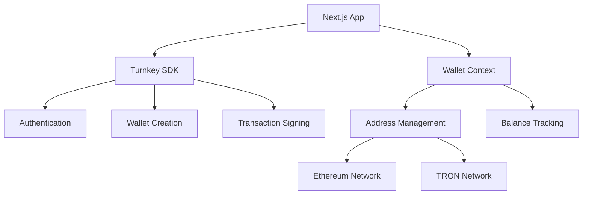

# 🚀 Multi-Chain Wallet DApp with Turnkey Integration

A production-ready **Next.js** application featuring multi-chain wallet management with **Ethereum** and **TRON** support, powered by **Turnkey's Embedded Wallet SDK**. This application demonstrates secure wallet creation, transaction management, and cross-chain functionality with enterprise-grade security practices.

[](https://nextjs.org/)
[](https://www.typescriptlang.org/)
[](https://www.turnkey.com/)
[](https://tailwindcss.com/)

## 📋 Table of Contents

- [Features](#-features)
- [Architecture Overview](#-architecture-overview)
- [Project Structure](#-project-structure)
- [What is Turnkey?](#-what-is-turnkey)
- [Turnkey Implementation](#-turnkey-implementation)
- [Getting Started](#-getting-started)
- [Environment Setup](#-environment-setup)
- [API Reference](#-api-reference)
- [Security Considerations](#-security-considerations)
- [Contributing](#-contributing)

## ✨ Features

### 🔐 **Secure Authentication & Wallet Management**
- **Passkey Authentication**: Biometric and hardware key support via WebAuthn
- **Email Authentication**: Traditional email-based login with secure session management
- **Multi-Chain Support**: Native support for Ethereum and TRON networks
- **Embedded Wallet Creation**: Automatic wallet generation with proper key derivation

### 💼 **Wallet Operations**
- **Dynamic Address Management**: Switch between Ethereum and TRON addresses seamlessly
- **Balance Tracking**: Real-time balance updates with proper currency conversion
- **Transaction Simulation**: Mock transfer functionality with validation
- **Address Validation**: Network-specific address format validation
- **Copy & Share**: One-click address copying with toast notifications

### 🎨 **User Experience**
- **Modal Interface**: Clean transaction modals with backdrop effects
- **Toast Notifications**: Real-time feedback for user actions
- **Dropdown Navigation**: Intuitive wallet type switching
- **Loading States**: Proper loading indicators for async operations

### 🔧 **Developer Features**
- **TypeScript**: Full type safety and IntelliSense support
- **Component Architecture**: Reusable, maintainable React components
- **Custom Hooks**: Centralized state management with React hooks
- **Error Handling**: Comprehensive error boundaries and validation
- **ESLint Configuration**: Code quality and consistency enforcement

## 🏗️ Architecture Overview



## 📁 Project Structure

```
turn_key_app/
├── app/                          # Next.js 14 App Router
│   ├── api/                      # API routes
│   │   └── faucet/              # Faucet endpoint
│   ├── dashboard/               # Dashboard page
│   ├── layout.tsx              # Root layout
│   ├── page.tsx               # Landing page
│   └── globals.css           # Global styles
├── components/                  # Reusable UI components
│   ├── ActivityCard.tsx        # Transaction activity display
│   ├── ActivityRow.tsx         # Individual transaction row
│   ├── FaucetForm.tsx          # Faucet interaction form
│   ├── NavBar.tsx              # Navigation component
│   ├── ToastProvider.tsx       # Toast notification wrapper
│   └── WalletCard.tsx          # Main wallet interface
├── context/                     # React Context providers
│   └── WalletContext.tsx       # Global wallet state management
├── hooks/                       # Custom React hooks
│   ├── useTurnkeyAuth.ts       # Turnkey authentication logic
│   └── useWallet.ts            # Wallet operations hook
├── lib/                         # Utility libraries
│   ├── api/                     # API utilities
│   ├── auth/                    # Authentication helpers
│   ├── constants/               # Application constants
│   ├── faucet/                  # Faucet utilities
│   ├── theme/                   # Theme configuration
│   └── utils/                   # Helper functions
├── styles/                      # CSS modules
│   ├── Activity.module.css
│   ├── Home.module.css
│   ├── ModalStyles.module.css
│   └── Nav.module.css
├── types/                       # TypeScript type definitions
│   ├── auth.ts                 # Authentication types
│   └── wallets.ts              # Wallet-related types
└── public/                      # Static assets
```

## 🔑 What is Turnkey?

**Turnkey** is a secure, programmable cryptographic infrastructure that enables developers to build applications with embedded wallets without compromising on security. It provides:

### Core Capabilities
- **Non-Custodial Wallets**: Users maintain full control of their private keys
- **Hardware Security Modules (HSMs)**: Enterprise-grade key storage and management
- **Policy Engine**: Programmable transaction policies and approval workflows
- **Multi-Party Computation (MPC)**: Distributed key generation and signing
- **Biometric Authentication**: WebAuthn integration for passwordless login

### Key Benefits
- **🛡️ Security First**: Private keys never leave secure enclaves
- **🚀 Developer Friendly**: Simple APIs and SDKs for rapid integration
- **⚡ Performance**: Sub-second transaction signing and wallet operations
- **🌐 Multi-Chain**: Support for 20+ blockchain networks
- **📱 User Experience**: Seamless onboarding without seed phrases

## 🔧 Turnkey Implementation

### 1. **SDK Integration**

The application integrates Turnkey through their React SDK:

```typescript
import { useTurnkey } from "@turnkey/sdk-react";

// Initialize Turnkey client
const { turnkey, indexedDbClient } = useTurnkey();
```

### 2. **Authentication Flow**

```typescript
// Authentication with passkey or email
const onAuthSuccess = async () => {
  const session = await turnkey?.getSession();
  if (session?.organizationId) {
    // User authenticated successfully
    await initializeWallets();
  }
};
```

### 3. **Wallet Creation**

Wallets are created with proper derivation paths for each supported blockchain. **Important learning**: Turnkey automatically creates Ethereum and Solana wallets by default during signup, so we need to handle existing wallets properly.

#### **Key Implementation Insight:**

During development, we discovered that Turnkey automatically generates default wallets (Ethereum and Solana) upon user signup. This required implementing a check to avoid duplicate wallet creation:

```typescript
// Check existing wallets before creating new ones
const existingWallets = await indexedDbClient?.getWallets({
  organizationId,
});

// Only create additional wallets if user has fewer than 2 wallets
if (existingWallets?.wallets.length < 2) {
  const walletResponse = await indexedDbClient.createWallet({
    organizationId,
    walletName: "My Multi-Chain Wallet",
    accounts: [
      WALLET_DERIVATION_CONFIG?.tron,     // TRON configuration
      WALLET_DERIVATION_CONFIG?.ethereum, // Ethereum configuration
    ],
  });
}
```

#### **Complete Wallet Configuration:**

```typescript
// Wallet derivation configuration (from lib/constants/wallets.ts)
const WALLET_DERIVATION_CONFIG = {
  ethereum: {
    curve: "CURVE_SECP256K1",
    pathFormat: "PATH_FORMAT_BIP32",
    path: "m/44'/60'/0'/0/0",
    addressFormat: "ADDRESS_FORMAT_ETHEREUM",
  },
  tron: {
    curve: "CURVE_SECP256K1",
    pathFormat: "PATH_FORMAT_BIP32", 
    path: "m/44'/195'/0'/0/0",
    addressFormat: "ADDRESS_FORMAT_TRON",
  }
};

const createMultiChainWallet = async () => {
  const session = await turnkey?.getSession();
  
  // Check for existing wallets first
  const existingWallets = await indexedDbClient?.getWallets({
    organizationId: session.organizationId,
  });

  if (existingWallets?.wallets.length < 2) {
    const wallet = await indexedDbClient?.createWallet({
      organizationId: session.organizationId,
      walletName: "Multi-Chain Wallet",
      accounts: [
        WALLET_DERIVATION_CONFIG.tron,
        WALLET_DERIVATION_CONFIG.ethereum,
      ],
    });
    console.log("✅ New multi-chain wallet created");
  } else {
    console.log("✅ Using existing wallets");
  }
};
```

#### **Best Practices Learned:**

1. **Always check existing wallets** before creating new ones
2. **Use configuration objects** for wallet derivation paths
3. **Handle both new and returning users** gracefully
4. **Implement proper error handling** for wallet operations

### 4. **Transaction Signing**

```typescript
const signTransaction = async (payload: string, addressType: string) => {
  const result = await client.signRawPayload({
    organizationId: session.organizationId,
    signWith: walletAddress,
    payload: payload,
    encoding: "ENCODING_HEXADECIMAL",
    hashFunction: "HASH_FUNCTION_SHA256",
  });
  
  return result.signature;
};
```

### 5. **State Management**

The `WalletContext` provides centralized state management:

```typescript
interface WalletContextType {
  loading: boolean;
  session: Session | null;
  ethAddress: WalletAddress[];
  getAccountAddress: () => Promise<WalletAddress[]>;
  signMessage: () => Promise<void>;
  handleLogout: () => Promise<void>;
}
```

## 🚀 Getting Started

### Prerequisites

- **Node.js** 18.17 or later
- **npm** or **yarn** package manager
- **Modern browser** with WebAuthn support

### Installation

1. **Clone the repository**
   ```bash
   git clone https://github.com/Samrat-Mukherjee/turnkey-dapp.git
   cd turnkey-dapp
   ```

2. **Install dependencies**
   ```bash
   npm install
   # or
   yarn install
   ```

3. **Set up environment variables**
   ```bash
   cp .env.example .env.local
   ```

4. **Configure Turnkey credentials**
   ```bash
   # .env.local
   NEXT_PUBLIC_ORGANIZATION_ID=your_organization_id
   TURNKEY_API_PUBLIC_KEY=your_api_public_key
   TURNKEY_API_PRIVATE_KEY=your_api_private_key
   NEXT_PUBLIC_BASE_URL=http://localhost:3000
   CHAINSTACK_API_KEY=your_chainstack_api_key
   ```

5. **Start the development server**
   ```bash
   npm run dev
   # or
   yarn dev
   ```

6. **Open your browser**
   Navigate to `http://localhost:3000`

## ⚙️ Environment Setup

Create a `.env.local` file in the root directory:

```bash
# Turnkey Configuration
NEXT_PUBLIC_ORGANIZATION_ID=your_organization_id
TURNKEY_API_PUBLIC_KEY=your_api_public_key
TURNKEY_API_PRIVATE_KEY=your_api_private_key

# API Configuration
NEXT_PUBLIC_BASE_URL=http://localhost:3000

# Blockchain Services
CHAINSTACK_API_KEY=your_chainstack_api_key

# Development flags (optional)
NODE_ENV=development
```

### Required Environment Variables

| Variable | Description | Required |
|----------|-------------|----------|
| `NEXT_PUBLIC_ORGANIZATION_ID` | Your Turnkey organization ID | ✅ |
| `TURNKEY_API_PUBLIC_KEY` | Your API public key (server-side) | ✅ |
| `TURNKEY_API_PRIVATE_KEY` | Your API private key (server-side) | ✅ |
| `NEXT_PUBLIC_BASE_URL` | Base URL for your application | ✅ |
| `CHAINSTACK_API_KEY` | Chainstack API key for blockchain operations | ✅ |

## 📚 API Reference

### Wallet Operations

```typescript
// Get all wallet addresses
const addresses = await getAccountAddress();

// Sign a message or transaction
await signMessage(message);

// Create new wallet account
await createWallet(config);

// Refresh wallet data
await refreshWallet();
```

### Utility Functions

```typescript
// Shorten any blockchain address
const short = shortenAddress("0x742d35Cc..."); // "0x742d...64a"
const short = shortenAddress("TDSVG2RV6X..."); // "TDSVG2...mjQ"

// Copy address to clipboard
await copyAddress(address);

// Validate addresses
const isValidEth = /^0x[a-fA-F0-9]{40}$/.test(address);
const isValidTron = /^T[1-9A-HJ-NP-Za-km-z]{33}$/.test(address);
```

## 🔒 Security Considerations

### 🛡️ **Production Readiness Checklist**

- [x] **Private Key Security**: Keys stored in Turnkey's HSM infrastructure
- [x] **Input Validation**: All user inputs validated on client and server
- [x] **Error Handling**: Comprehensive error boundaries and logging
- [x] **Type Safety**: Full TypeScript coverage with strict mode
- [x] **Authentication**: Secure session management with automatic refresh
- [ ] **Rate Limiting**: Implement API rate limiting (recommended for production)
- [ ] **HTTPS Enforcement**: Ensure HTTPS in production deployments
- [ ] **CSP Headers**: Content Security Policy headers (recommended)

### 🔐 **Security Best Practices Implemented**

1. **Non-Custodial Design**: Private keys never leave Turnkey's secure enclaves
2. **Session Management**: Automatic session refresh and secure logout
3. **Input Sanitization**: All addresses and amounts validated before processing
4. **Error Boundaries**: Graceful error handling prevents crashes
5. **Type Safety**: TypeScript prevents runtime type errors


### Development Guidelines

- Follow the existing code style and conventions
- Write comprehensive tests for new features
- Update documentation for any API changes
- Ensure all TypeScript types are properly defined
- Test across different browsers and devices

## 📄 License

This project is licensed under the MIT License - see the [LICENSE](LICENSE) file for details.

## 🙏 Acknowledgments

- **Turnkey Team** for their excellent SDK and documentation
- **Next.js Team** for the robust React framework
- **Tailwind CSS** for the utility-first CSS framework
- **Open Source Community** for various utilities and libraries

---

**Built with ❤️ by [Samrat Mukherjee](https://github.com/Samrat-Mukherjee)**

For questions or support, please [open an issue](https://github.com/Samrat-Mukherjee/turnkey-dapp/issues) or contact the development team.
